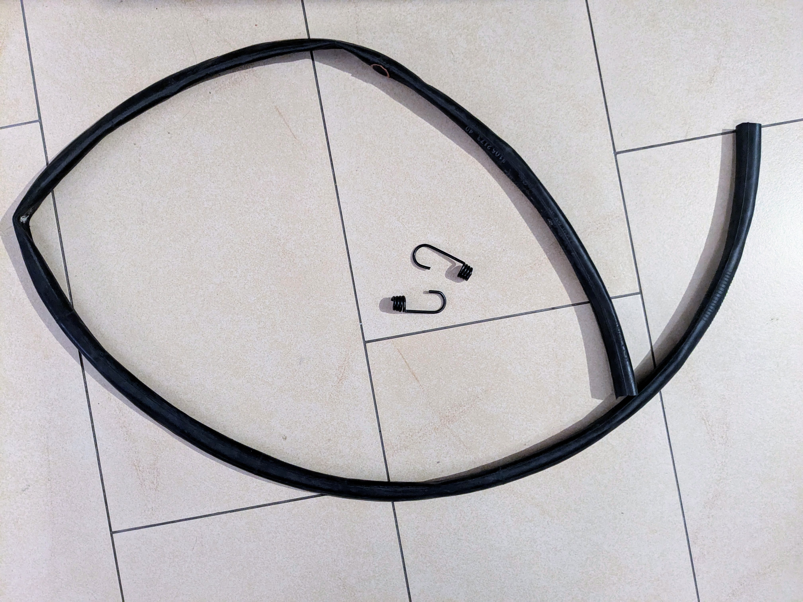
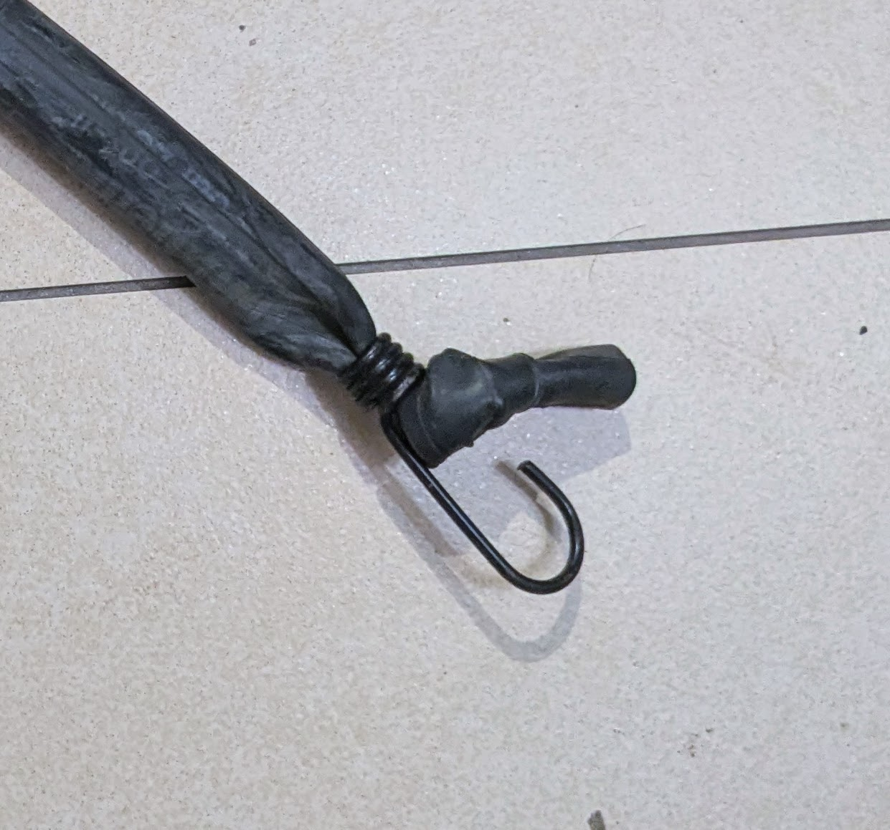

{{ $before := .Resources.Get "fahrradschlauch-spanngummi.jpg" }}
{{ $after := .Resources.Get "fahrradschlauch-spanngummi-repariert.jpg" }}

Bei mir haben sich im Laufe meiner Radlerkarriere einige alte Fahrradschläuche
angesammelt. Um genau zu sein duzende. Meist tausche ich den defekten Schlauch
gegen einen neuen aus und repariere dann den alten mit einem Flicken, um einen
Reserveschlauch dabeizuhaben.

## Gepäcksspanner aus altem Fahrradschlauch

Da ich auch viele Sachen am Rad transportiere habe ich auch einige Gepäcksspanner zuhause. Diese haben leider die Eigenschaft, dass der Gummi nach einiger Zeit ausleiert.

Mit einem alten Fahrradschlauch kann man das Problem einfach beheben: Man ersetzt einfach das Seil vom Spanngummi durch den Fahrradschlauch. 

Wir brauchen:
  - 1 Fahrradschlauch (am besten Rennrad oder Citybike)
  - 2 Haken von einem alten Spanngummi

  

Zuerst schneidet man das Ventil raus: Hierzu den Schlauch davor und danach durchschneiden. Dann kommt das Einfädeln: Wenn man den Schlauch eng längs zusammenrollt, passt er durch das Loch der Drahthaken.
Dann einfach einen Knoten ans Ende und schon ist die Reparatur vollenedet!

 

Dazu eignen sich sehr gut die Schläuche von Rennrädern oder Stadträdern, weniger dicke Mountainbikeschläuche.

## Direkt am Gepäckträger einfädeln als Gepäcksspanner

Wer keinen alten Gepäcksspanner zur Hand hat, kann einen alten Fahrradschlauch auch direkt 
am Gepäckträger anbringen. Dazu das Ventil entfernen und den Schlauch quer durchschneiden. Dann
am besten in zwei Schlaufen durch den Gepäcksträger fädeln. So erhält man
Schlaufen in passender Länge um Gepäck zu befestigen. Je nach Größe des Gepäcksstück
und benötigter Spannung kann man dann nur eine, zwei oder alle drei Schlaufen nehmen.

## Verwendung als "Resistance Band"

Gerade die breiteren Schläuche von Mountainbikes eignen sich sehr gut als Resistance Band, also als Gummizug für Kraftübungen. Wenn man wissen will, wie stark der Gummi ist kann man eine Gepäckwaage nehmen.

Habt ihr noch weitere Ideen für die Wiederverwendung von alten Fahrradschläuchen?

## Verrücktes ...

Ich spiele ja mit den Gedanken eine Riesenschleuder aus einem alten Mountainbikeschlauch zu bauen.
Wenn ich mal dazu kommen sollte, folgen hier Fotos.